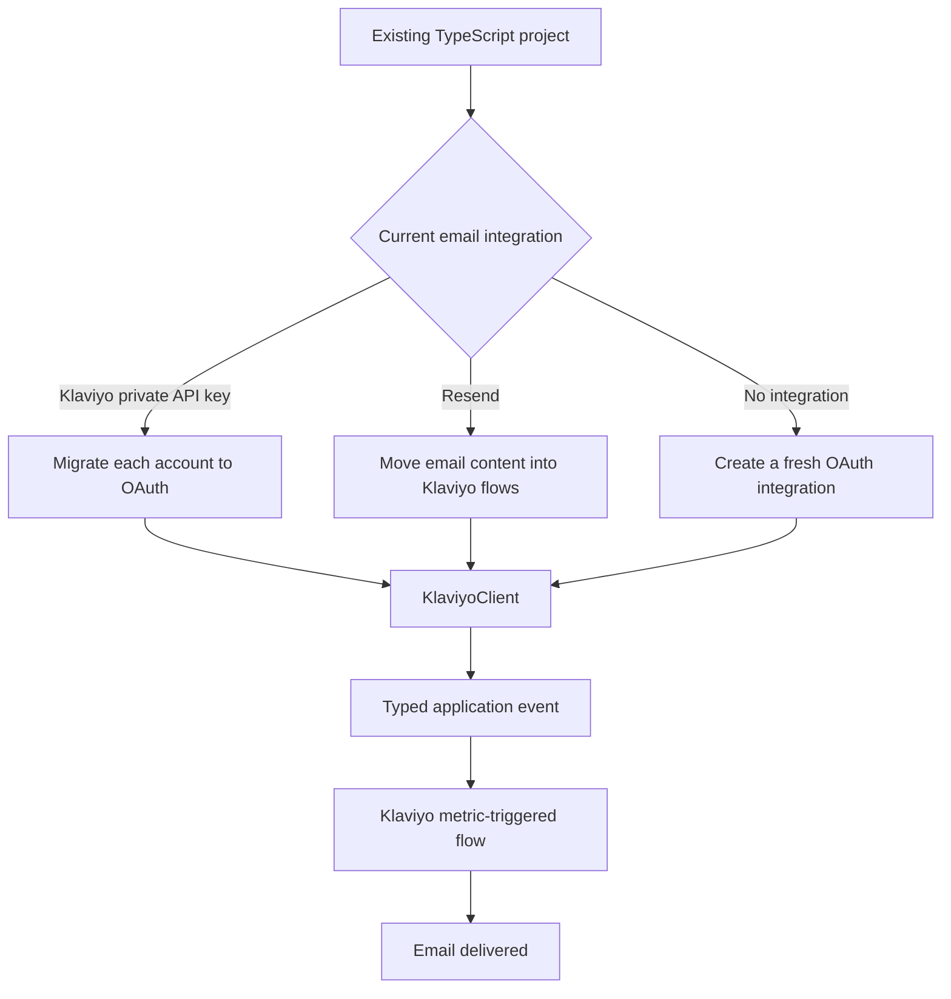

# Attach `@fullsnacklab/klaviyo-rewards-adapter` to a TypeScript project

**What you’ll learn**

- Connect an existing TypeScript application to Klaviyo through OAuth.
- Migrate from a Klaviyo private API key without interrupting existing accounts.
- Replace Resend with event-triggered Klaviyo emails.
- Configure a fresh integration from scratch.
- Test the integration with a real email.

**Prerequisites**

- Node.js 22 or later
- A server-side TypeScript application
- A Klaviyo OAuth app
- A database or existing token repository
- A server-side session mechanism for the OAuth handshake

**Time estimate:** 30–60 minutes

**Final result:** Your application emits typed events through this package, and Klaviyo flows turn those events into emails.

---

## 1. Choose your starting point



All three paths converge on the same consumer API:

```ts
await triggerTransactionalEmail(client, {
  name: "Password Reset Requested",
  profile: {
    identifier: "email",
    email: "customer@yourdomain.com",
  },
  properties: {
    resetUrl: "https://app.yourdomain.com/reset/abc123",
    expiresAt: "2026-09-17T02:00:00.000Z",
  },
  uniqueId: crypto.randomUUID(),
});
```

> **Important:** This package does not accept an HTML body and send it directly. Your application emits a business event; a Klaviyo flow owns the sender, subject, template, and delivery rules.

---

## 2. Install the package

```sh
npm install @fullsnacklab/klaviyo-rewards-adapter
```

For a workspace package:

```json
{
  "dependencies": {
    "@fullsnacklab/klaviyo-rewards-adapter": "workspace:*"
  }
}
```

If you install from a local checkout, build the package first, and then add it:

```sh
npm install ../full-snack-klaviyo-rewards
```

### Checkpoint

This import must type-check:

```ts
import {
  KlaviyoClient,
  triggerTransactionalEmail,
} from "@fullsnacklab/klaviyo-rewards-adapter";
```

---

## 3. Configure the Klaviyo OAuth app

In the Klaviyo developer console:

1. Create or open your OAuth app.
2. Add your callback URL, for example:

   ```text
   https://app.yourdomain.com/integrations/klaviyo/callback
   ```

3. Enable the scopes your application needs.

For event-triggered email only:

```text
events:write
```

Additional package features require these scopes:

| Consumer function | Scope |
| --- | --- |
| `createEvent` | `events:write` |
| `triggerTransactionalEmail` | `events:write` |
| `triggerMarketingEmail` | `campaigns:write` |
| `readProfile` | `profiles:read` |
| `pullReviews` | `reviews:read` |

Use `FEATURE_SCOPES` only when your application uses every built-in feature. Otherwise, request the smallest applicable set.

Store the OAuth credentials as server-side secrets:

```env
KLAVIYO_CLIENT_ID=your-client-id
KLAVIYO_CLIENT_SECRET=your-client-secret
KLAVIYO_REDIRECT_URI=https://app.yourdomain.com/integrations/klaviyo/callback
```

> **Warning:** Never expose `KLAVIYO_CLIENT_SECRET`, access tokens, or refresh tokens to browser code.

---

## 4. Connect the package to your token repository

The package handles token exchange, token refresh, retry behavior, and in-process refresh deduplication. Your application supplies storage through `TokenStore`.

Bind it to your existing data layer:

```ts
import type { TokenStore } from "@fullsnacklab/klaviyo-rewards-adapter";
import { klaviyoConnections } from "./database/klaviyo-connections.ts";

export const klaviyoTokenStore: TokenStore = {
  load: (accountId) => klaviyoConnections.loadTokens(accountId),

  save: (accountId, tokens) =>
    klaviyoConnections.saveTokensAtomically(accountId, tokens),

  delete: (accountId) =>
    klaviyoConnections.deleteTokens(accountId),

  runExclusive: (accountId, operation) =>
    klaviyoConnections.withAccountLock(accountId, operation),
};
```

Your database record needs these values:

```ts
type StoredKlaviyoConnection = {
  accountId: string;
  accessToken: string;
  refreshToken: string;
  expiresAt: Date;
};
```

The storage contract has four important requirements:

1. Return `expiresAt` as a real `Date`, not an ISO string.
2. Save the access token, refresh token, and expiration atomically.
3. Encrypt tokens at rest.
4. Use a distributed account-level lock when multiple application processes can refresh the same account.

> **Tip:** `accountId` is your application’s identifier for the connected tenant or merchant. It does not need to be a Klaviyo-generated account ID.

---

## 5. Create a typed client factory

Define every event your application may send:

```ts
// src/integrations/klaviyo.ts
import {
  KlaviyoClient,
  type JsonObject,
} from "@fullsnacklab/klaviyo-rewards-adapter";
import { klaviyoTokenStore } from "./klaviyo-token-store.ts";

type EmailEvents = {
  "Password Reset Requested": {
    resetUrl: string;
    expiresAt: string;
  };

  "Order Shipped": {
    orderId: string;
    trackingUrl: string;
    carrier: string;
  };

  "Reward Redeemed": {
    rewardId: string;
    points: number;
  };
};

function requiredEnvironmentVariable(name: string): string {
  const value = process.env[name]?.trim();

  if (!value) {
    throw new Error(`${name} is required`);
  }

  return value;
}

const credentials = {
  clientId: requiredEnvironmentVariable("KLAVIYO_CLIENT_ID"),
  clientSecret: requiredEnvironmentVariable("KLAVIYO_CLIENT_SECRET"),
};

export function klaviyoFor(accountId: string) {
  return new KlaviyoClient<EmailEvents, JsonObject>({
    accountId,
    credentials,
    tokenStore: klaviyoTokenStore,
  });
}
```

The event catalog now checks names and properties at compile time.

This compiles:

```ts
await triggerTransactionalEmail(klaviyoFor(accountId), {
  name: "Order Shipped",
  profile: {
    identifier: "email",
    email: customer.email,
  },
  properties: {
    orderId: order.id,
    trackingUrl: shipment.trackingUrl,
    carrier: shipment.carrier,
  },
  uniqueId: `shipment:${shipment.id}`,
});
```

This does not compile:

```ts
await triggerTransactionalEmail(klaviyoFor(accountId), {
  name: "Order Shipped",
  profile: {
    identifier: "email",
    email: customer.email,
  },
  properties: {
    orderId: order.id,
    // Error: trackingUrl and carrier are missing.
  },
});
```

### Checkpoint

Run your project’s type checker:

```sh
npm run type-check
```

Expected result: misspelled event names and missing event properties fail at compile time.

---

## 6. Add the OAuth connection flow

The package generates PKCE values and exchanges authorization codes. Your application only needs to store the pending state and verifier in its existing server-side session.

Define the session value:

```ts
type KlaviyoOAuthSession = {
  state: string;
  codeVerifier: string;
};
```

### Start authorization

Call this from your “Connect Klaviyo” route:

```ts
import { klaviyoFor } from "./integrations/klaviyo.ts";

const redirectUri = process.env.KLAVIYO_REDIRECT_URI!;

export async function beginKlaviyoConnection(
  accountId: string,
  session: { klaviyoOAuth?: KlaviyoOAuthSession },
): Promise<string> {
  const state = crypto.randomUUID();
  const client = klaviyoFor(accountId);

  const pending = await client.beginAuthorization({
    state,
    redirectUri,
    scopes: ["events:write"],
  });

  session.klaviyoOAuth = {
    state,
    codeVerifier: pending.codeVerifier,
  };

  return pending.authorizationUrl;
}
```

Redirect the browser to the returned URL:

```ts
const authorizationUrl = await beginKlaviyoConnection(
  currentAccount.id,
  request.session,
);

response.redirect(authorizationUrl);
```

### Complete authorization

Call this from the configured callback route:

```ts
import {
  parseOAuthCallback,
} from "@fullsnacklab/klaviyo-rewards-adapter";
import { klaviyoFor } from "./integrations/klaviyo.ts";

const redirectUri = process.env.KLAVIYO_REDIRECT_URI!;

export async function completeKlaviyoConnection(
  accountId: string,
  callbackUrl: string,
  session: { klaviyoOAuth?: KlaviyoOAuthSession },
): Promise<void> {
  const pending = session.klaviyoOAuth;

  if (!pending) {
    throw new Error("The Klaviyo authorization session has expired");
  }

  const callback = parseOAuthCallback(callbackUrl);

  if (callback.status === "denied") {
    delete session.klaviyoOAuth;
    throw new Error(
      callback.errorDescription ?? `Klaviyo authorization failed: ${callback.error}`,
    );
  }

  if (callback.state !== pending.state) {
    delete session.klaviyoOAuth;
    throw new Error("Klaviyo OAuth state mismatch");
  }

  delete session.klaviyoOAuth;

  await klaviyoFor(accountId).completeAuthorization({
    code: callback.code,
    codeVerifier: pending.codeVerifier,
    redirectUri,
  });
}
```

Pass an absolute callback URL:

```ts
await completeKlaviyoConnection(
  currentAccount.id,
  new URL(request.url, "https://app.yourdomain.com").href,
  request.session,
);
```

### Checkpoint

After authorization:

1. Your token repository contains an access token and refresh token.
2. `expiresAt` is a valid `Date`.
3. The browser returns to your application.
4. No token appears in browser storage or the callback URL.

> **Warning:** Klaviyo authorization codes expire after five minutes. Restart authorization instead of retrying an old code.

---

## Path A: Start fresh

### 7. Create the first event

Before you can select a custom metric as a flow trigger, send one event to create that metric in Klaviyo.

```ts
import {
  triggerTransactionalEmail,
} from "@fullsnacklab/klaviyo-rewards-adapter";
import { klaviyoFor } from "./integrations/klaviyo.ts";

await triggerTransactionalEmail(klaviyoFor(accountId), {
  name: "Password Reset Requested",
  profile: {
    identifier: "email",
    email: "your-real-test-inbox@yourdomain.com",
  },
  properties: {
    resetUrl: "https://app.yourdomain.com/reset/test-token",
    expiresAt: new Date(Date.now() + 30 * 60_000).toISOString(),
  },
  uniqueId: crypto.randomUUID(),
});
```

Expected result: the promise resolves without an API error.

A resolved promise means Klaviyo accepted the event for asynchronous processing. It does not prove that an email was delivered.

> **Warning:** Klaviyo may silently discard events sent to addresses on domains such as `example.com` or `test.com`, even though the API returns `202 Accepted`. Use a real test inbox.

### 8. Create the Klaviyo flow

In Klaviyo:

1. Open **Flows**.
2. Create a flow from scratch.
3. Select **Metric** as the trigger.
4. Select **Password Reset Requested**.
5. Add an email action.
6. Configure the sender and branded sending domain.
7. Build the subject and body in Klaviyo.
8. Insert `resetUrl` and `expiresAt` from the triggering event.
9. Preview the email with the test event.
10. Set the email action to **Live**.

For strictly operational email, apply for transactional status in Klaviyo. Transactional status is assigned per email, requires an eligible paid account, and requires Klaviyo approval.

### 9. Send the real event

```ts
export async function sendPasswordResetEmail(input: {
  accountId: string;
  email: string;
  resetId: string;
  resetUrl: string;
  expiresAt: Date;
}): Promise<void> {
  await triggerTransactionalEmail(klaviyoFor(input.accountId), {
    name: "Password Reset Requested",
    profile: {
      identifier: "email",
      email: input.email,
    },
    properties: {
      resetUrl: input.resetUrl,
      expiresAt: input.expiresAt.toISOString(),
    },
    uniqueId: `password-reset:${input.resetId}`,
  });
}
```

Use the same `uniqueId` when retrying the same logical operation. Klaviyo deduplicates events by profile, metric, and `uniqueId`.

### Checkpoint

Confirm all three results:

- The profile activity feed contains **Password Reset Requested**.
- The profile entered the expected flow.
- The test inbox received the message.

---

## Path B: Replace Resend

### 10. Understand what changes ownership

A Resend call usually owns the complete message:

```ts
const { error } = await resend.emails.send({
  from: "Full Snack <alerts@fullsnacklab.com>",
  to: customer.email,
  subject: "Reset your password",
  html: renderPasswordResetEmail({
    resetUrl,
    expiresAt,
  }),
});

if (error) {
  throw new Error(error.message);
}
```

With this package, your application owns the event data, while Klaviyo owns the message:

```ts
await triggerTransactionalEmail(klaviyoFor(accountId), {
  name: "Password Reset Requested",
  profile: {
    identifier: "email",
    email: customer.email,
  },
  properties: {
    resetUrl,
    expiresAt: expiresAt.toISOString(),
  },
  uniqueId: `password-reset:${reset.id}`,
});
```

Use this migration map:

| Resend responsibility | Klaviyo replacement |
| --- | --- |
| `to` | Event profile email |
| `from` | Klaviyo flow sender settings |
| `subject` | Klaviyo flow email subject |
| `html`, `text`, or React template | Klaviyo flow template |
| Template variables | Event `properties` |
| Idempotency key | Event `uniqueId` |
| Scheduled send | Klaviyo flow delay or scheduling |
| Delivery analytics | Klaviyo flow analytics |
| Verified sending domain | Klaviyo branded sending domain |

There is no direct replacement in this package for arbitrary attachments or a unique HTML body supplied with every request. Keep a direct email provider for those messages, or host the file securely and place a short-lived link in the Klaviyo template.

### 11. Migrate without sending duplicates

Use this sequence:

1. Keep the existing Resend call active.
2. Create the equivalent typed Klaviyo event.
3. Create the Klaviyo flow with its email action in **Manual** mode.
4. Emit Klaviyo events while Resend continues delivering email.
5. Verify event properties, profile matching, and flow entry.
6. Set the Klaviyo email action to **Live**.
7. Disable the Resend path.
8. Send one controlled test event.
9. Remove `RESEND_API_KEY` only after production verification.

Do not run Resend and a live Klaviyo flow for the same event unless duplicate email is intentional.

A temporary cutover flag can keep the transition explicit:

```ts
export async function sendPasswordReset(
  input: PasswordResetEmailInput,
): Promise<void> {
  if (process.env.PASSWORD_RESET_PROVIDER === "klaviyo") {
    await sendPasswordResetWithKlaviyo(input);
    return;
  }

  await sendPasswordResetWithResend(input);
}
```

Remove the flag and the Resend branch after the migration is stable.

### Checkpoint

Before removing Resend, verify:

- The Klaviyo event contains every value used by the old template.
- The flow sender and reply-to settings match the old behavior.
- The branded sending domain passes authentication.
- The email action is Live.
- A real inbox receives only one message.
- Bounce, suppression, and delivery behavior meet your requirements.

---

## Path C: Transition from a private Klaviyo API key

### 12. Run OAuth beside the existing connection

A private-key integration may authenticate requests like this:

```ts
await fetch("https://a.klaviyo.com/api/events", {
  method: "POST",
  headers: {
    Authorization: `Klaviyo-API-Key ${process.env.KLAVIYO_PRIVATE_API_KEY}`,
    "Content-Type": "application/vnd.api+json",
    revision: "2026-07-15",
  },
  body: JSON.stringify(payload),
});
```

Do not attempt to convert the private API key into an OAuth token. Each connected Klaviyo account must authorize the OAuth app.

Add the OAuth connection flow from sections 3–6 while the existing private-key path remains available.

Track the authentication mode per account:

```ts
type KlaviyoAuthenticationMode =
  | "private-key"
  | "oauth";
```

Migrate accounts individually:

1. Ask an account owner or administrator to connect the OAuth app.
2. Request only the scopes required by that account’s features.
3. Verify that the token store contains the new OAuth tokens.
4. Send a controlled event through `createEvent` or `triggerTransactionalEmail`.
5. Mark the account as using OAuth.
6. Stop using its private API key.
7. Remove private-key support after every account has migrated.

> **Important:** Adding a scope later requires affected accounts to authorize the app again. A token cannot use a scope that was not granted during authorization.

### 13. Replace private-key event calls

Replace a hand-built event request with `createEvent`:

```ts
import {
  createEvent,
} from "@fullsnacklab/klaviyo-rewards-adapter";
import { klaviyoFor } from "./integrations/klaviyo.ts";

await createEvent(klaviyoFor(accountId), {
  name: "Reward Redeemed",
  profile: {
    identifier: "email",
    email: customer.email,
    firstName: customer.firstName,
    properties: {
      loyaltyTier: customer.loyaltyTier,
    },
  },
  properties: {
    rewardId: reward.id,
    points: reward.points,
  },
  uniqueId: `reward-redemption:${redemption.id}`,
});
```

Use `triggerTransactionalEmail` instead when the event specifically exists to trigger an email flow:

```ts
await triggerTransactionalEmail(klaviyoFor(accountId), {
  name: "Reward Redeemed",
  profile: {
    identifier: "email",
    email: customer.email,
  },
  properties: {
    rewardId: reward.id,
    points: reward.points,
  },
  uniqueId: `reward-redemption:${redemption.id}`,
});
```

The transactional helper always sends the event with `backfill: false`, allowing the event to trigger flows.

For historical migration events, use `createEvent` with `backfill: true`:

```ts
await createEvent(klaviyoFor(accountId), {
  name: "Reward Redeemed",
  profile: {
    identifier: "email",
    email: customer.email,
  },
  properties: {
    rewardId: reward.id,
    points: reward.points,
  },
  time: redemption.createdAt,
  uniqueId: `reward-redemption:${redemption.id}`,
  backfill: true,
});
```

Backfilled events remain available for metrics and segmentation but do not trigger flows.

### 14. Replace other private-key endpoints

Use the package’s built-in operations where applicable:

```ts
import {
  pullReviews,
  readProfile,
  triggerMarketingEmail,
} from "@fullsnacklab/klaviyo-rewards-adapter";

const profile = await readProfile(client, {
  profileId: "01H...",
});

const reviews = await pullReviews(client, {
  pageSize: 50,
  sort: "-created",
});

const sendJob = await triggerMarketingEmail(client, {
  campaignId: "campaign-id",
});
```

For official SDK APIs that the package does not wrap, use the authenticated session through `client.api`:

```sh
npm install klaviyo-api
```

```ts
import { FlowsApi } from "klaviyo-api";

const flowsApi = klaviyoFor(accountId).api(FlowsApi);
const flows = await flowsApi.getFlows();
```

This preserves the package’s OAuth storage, token refresh, and retry behavior without rebuilding authentication around each SDK class.

### 15. Retire the private key

Remove the private key only after:

- Every active account has completed OAuth authorization.
- Required scopes have been verified.
- API calls work through the OAuth client.
- Token refresh has succeeded in production.
- Disconnecting an account revokes its OAuth authorization.
- No fallback path still reads `KLAVIYO_PRIVATE_API_KEY`.

Revoke and delete old private API keys in Klaviyo after the cutover.

---

## 16. Disconnect an account

Expose a disconnect action in your application:

```ts
export async function disconnectKlaviyo(accountId: string): Promise<void> {
  await klaviyoFor(accountId).revoke();
}
```

`revoke()` revokes the stored refresh token. After Klaviyo confirms revocation, the package calls `TokenStore.delete` when your store implements it.

---

## 17. Test with a real email

Use a staging Klaviyo account or a dedicated test flow.

1. Authorize the account through your application.
2. Send one event before creating the flow to register the metric.
3. Create a metric-triggered flow.
4. Add one email action.
5. Send to a real inbox you control.
6. Set the action to Live.
7. Send a second event with a new `uniqueId`.
8. Check the profile activity feed.
9. Check the flow recipient activity.
10. Confirm delivery in the inbox.
11. Disable the temporary flow.

Example test call:

```ts
await triggerTransactionalEmail(klaviyoFor("staging-account"), {
  name: "Password Reset Requested",
  profile: {
    identifier: "email",
    email: process.env.KLAVIYO_TEST_EMAIL!,
  },
  properties: {
    resetUrl: "https://app.yourdomain.com/test-reset",
    expiresAt: new Date(Date.now() + 30 * 60_000).toISOString(),
  },
  uniqueId: crypto.randomUUID(),
});
```

Expected application result:

```text
The promise resolves without an API error.
```

Expected Klaviyo result:

```text
Event → profile activity → flow entry → sent email
```

---

## 18. Troubleshooting

| Symptom | Likely cause | Fix |
| --- | --- | --- |
| `No valid OAuth tokens were found` | Authorization was not completed, storage returned `null`, or `expiresAt` is not a `Date` | Inspect the token record and deserialize the expiration as a `Date` |
| Callback reports missing code or state | The Klaviyo account owner denied authorization, or the application reconstructed the callback URL incorrectly | Pass the complete absolute callback URL to `parseOAuthCallback` |
| OAuth state mismatch | The callback used a different or expired server session | Keep state and verifier in the same server-side session until callback |
| Token exchange fails | Redirect URI differs from the authorization request | Use the exact allowlisted URI for both calls |
| Authorization code fails | The code is older than five minutes or was already used | Start a new authorization request |
| API returns `403` | The account did not authorize the required scope | Add the scope and ask the account to authorize again |
| Event returns successfully but does not appear | A test-domain address was dropped, processing is delayed, or `uniqueId` was reused | Use a real inbox and a new ID for a new logical event |
| Event appears but no email sends | Flow trigger, filters, status, or email mode is wrong | Confirm the metric name and set the email action to Live |
| Duplicate email sends | Resend and Klaviyo are both live, or retries use new IDs | Enable one provider and reuse the logical event’s `uniqueId` |
| Refresh conflicts across servers | `runExclusive` is missing or only locks in memory | Use a distributed per-account lock |
| Transactional email skips recipients | The message is not approved as transactional or the profile is suppressed | Review transactional status and suppression details in Klaviyo |
| Template cannot reproduce a Resend feature | The message depends on arbitrary HTML, attachments, or per-request sender details | Keep that message on a direct email provider |

---

## 19. Practice challenges

### Challenge 1: Add an order-delivered event

Add this event to the catalog:

```ts
"Order Delivered": {
  orderId: string;
  deliveredAt: string;
};
```

Then write a call that triggers a Klaviyo flow for the customer.

<details>
<summary>Solution</summary>

```ts
await triggerTransactionalEmail(klaviyoFor(accountId), {
  name: "Order Delivered",
  profile: {
    identifier: "email",
    email: customer.email,
  },
  properties: {
    orderId: order.id,
    deliveredAt: delivery.completedAt.toISOString(),
  },
  uniqueId: `order-delivered:${delivery.id}`,
});
```

</details>

### Challenge 2: Find the retry bug

What is wrong with this retry loop?

```ts
for (let attempt = 0; attempt < 3; attempt += 1) {
  await triggerTransactionalEmail(client, {
    name: "Order Delivered",
    profile: {
      identifier: "email",
      email: customer.email,
    },
    properties: {
      orderId: order.id,
      deliveredAt: delivery.completedAt.toISOString(),
    },
    uniqueId: crypto.randomUUID(),
  });
}
```

<details>
<summary>Solution</summary>

Each attempt generates a different `uniqueId`, so Klaviyo sees three separate events. Generate one ID before the retry loop and reuse it:

```ts
const uniqueId = `order-delivered:${delivery.id}`;

for (let attempt = 0; attempt < 3; attempt += 1) {
  await triggerTransactionalEmail(client, {
    name: "Order Delivered",
    profile: {
      identifier: "email",
      email: customer.email,
    },
    properties: {
      orderId: order.id,
      deliveredAt: delivery.completedAt.toISOString(),
    },
    uniqueId,
  });
}
```

</details>

### Challenge 3: Decide whether to replace Resend

Keep Resend if the email requires:

- Arbitrary HTML generated for every request
- File attachments
- A different sender for every request
- Delivery without configuring a Klaviyo flow

Use this package if the email represents a stable business event and benefits from:

- Editable Klaviyo templates
- Metric-triggered automation
- Typed event properties
- Customer profiles and segmentation
- Flow analytics
- OAuth access to multiple Klaviyo accounts

---

## Summary

You attached the package as a consumer rather than rebuilding its OAuth or API behavior:

1. Your application supplies a `TokenStore`.
2. `KlaviyoClient` owns OAuth sessions, token refresh, and SDK authentication.
3. Your code emits typed business events.
4. Klaviyo flows own email content and delivery.
5. Private-key accounts migrate through user authorization.
6. Resend calls become semantic event calls when Klaviyo is the appropriate delivery model.

## Next steps

- Add production encryption and distributed locking to your token repository.
- Add one typed event at a time instead of creating a generic “send email” event.
- Monitor `401`, `403`, and flow-delivery failures.
- Call `revoke()` during account disconnection.
- Remove legacy private keys and `RESEND_API_KEY` after migration verification.

## Additional resources

- [Make API calls using OAuth](https://developers.klaviyo.com/en/docs/set_up_oauth)
- [Migrate from private key authentication to OAuth](https://developers.klaviyo.com/en/docs/migrate_to_oauth_from_private_key_authentication)
- [Klaviyo Events API overview](https://developers.klaviyo.com/en/reference/events_api_overview)
- [Use flows to send transactional emails](https://help.klaviyo.com/hc/en-us/articles/360003165732)
- [Resend Node.js email guide](https://resend.com/docs/send-with-nodejs)
